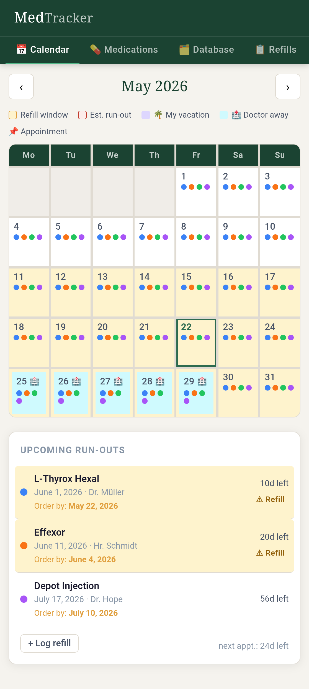
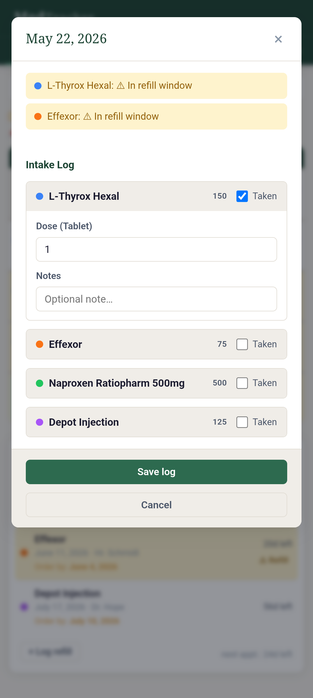
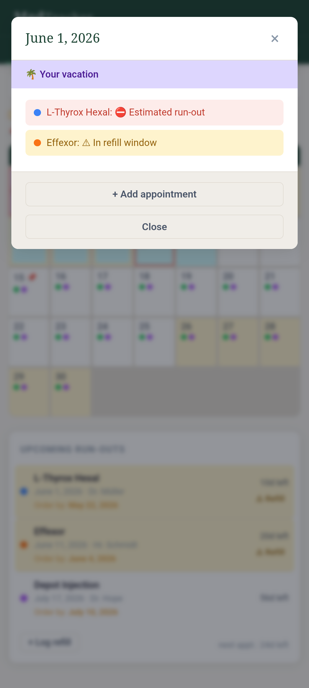
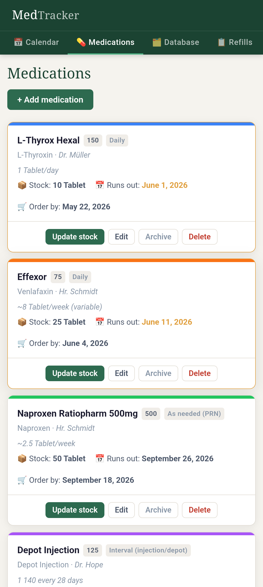
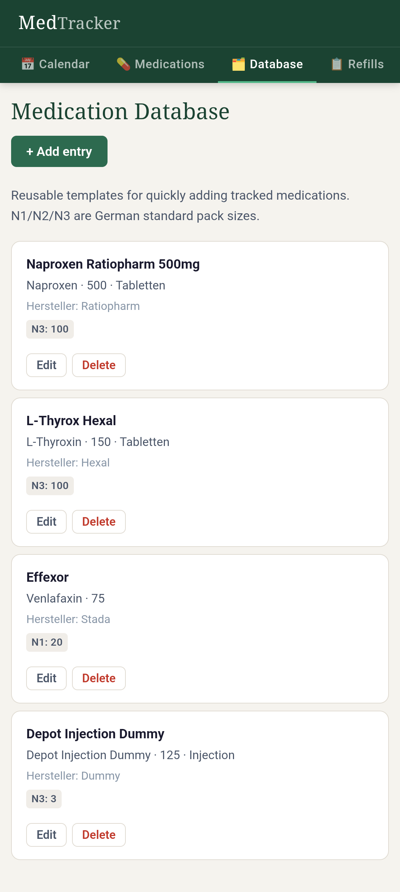
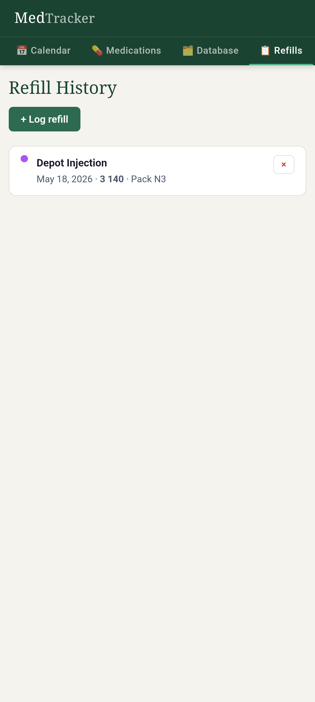
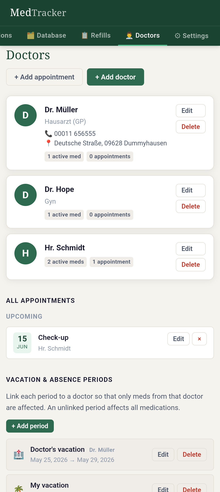
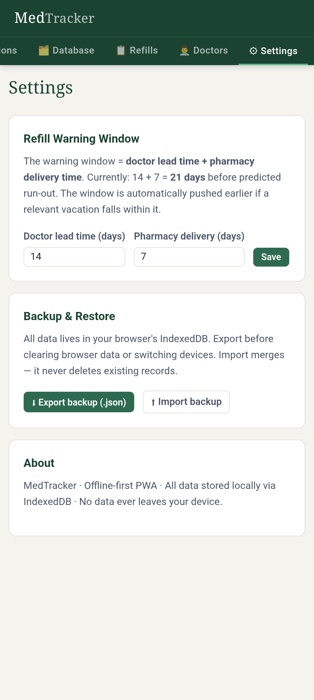
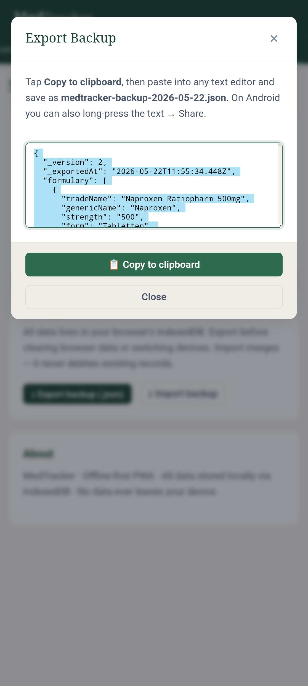

# MedTracker

A personal medication management app for people who take multiple medications and need to track stock levels, anticipate refill dates, and coordinate around doctor and vacation schedules.

It runs entirely in the browser. No account, no server, no data leaves your device.

[Here, take a look :palm_up_hand:](https://closer2u.github.io/MedTrack/)

***

> *Screenshots show representative mock data in PWA/standalone mode.*

<div align="center" style="display:flex;flex-direction:column;justify-content:center; align-items:flex-start; flex-wrap: wrap;">

   </img> 
   </img>
   </img>
   </img>
   </img>
   </img>
   </img>
   </img>
   </img>

</div>

--- 

## What it does

MedTracker is built around one core problem: knowing when you will run out of medication. 

The app calculates running stocks in contrast to consumption rates and finds the earliest date you need to act — accounting for how long it takes to get a prescription, how long the pharmacy takes to fill it, weekends (which are never counted as available days), and any vacation periods for you or your doctor.

_Specifically it does:_

- **Tracks stock** for multiple medications 
- **Projects run-out dates** and highlights a warning window on a monthly calendar
- **Accounts for weekends and vacations** — warning windows are pushed to the nearest viable Friday before any unavailability (yours or your doctor's)
- **Takes into account different intake types** — Daily fixed or Daily variable, Interval (e.g. monthly injections, every 28 days,...) or PRN (as needed)
- **Links medications to doctors** so Dr. A's holiday only affects prescriptions from Dr. A
- **Logs appointments** and shows them on the calendar 
- **Logs actual taken doses per day**, which then adjusts the stock accordingly 
- **Tracks refill history** including manufacturer, useful when tolerability varies across producers
- **Exports/imports** a full JSON backup; falls back to clipboard copy on Android WebViews where file downloads are blocked. Import merges the backup into the existing database, either its skipped or added, but nothing is deleted. 


<br> 

_Quality-of-Life features:_

- Maintains a separate database of medication entries that can be used as **templates** or for **tracking side effects**
- Keeps a **refill history**, including manufacturer name and notes, so you can correlate side effects across batches or producers
- **Shows upcoming doctor's appointments on the calendar** so the predicted run-out dates always have context 
- **Responsive design** with mobile-first in mind, but the layout adapts to wide screens (desktops), too

<br>


> [!CAUTION]
> Clearing the browser cache deletes the IndexedDB files. 
> Therefore regularly _exporting_ your data is strongly advised. 

--- 

## Getting started

### Using it immediately
Open the [live URL](https://closer2u.github.com/MedTracker) in any modern browser. On Android, use Chrome → "Add to Home Screen" to install it as a PWA. On iOS, use Safari → Share → "Add to Home Screen".


> [!TIP]
>It works offline after the first visit, installs as a PWA on Android and iOS, and can be compiled into a standalone APK via tools like [web-to-app](https://github.com/shiahonb777/web-to-app) converters or similar tools directly on the Android smartphone. 
> Updates to the code will display without having to recompile the apk, given the service worker handling caching and refetching. 


### Running locally 
Download the source code or clone the repo. 
Open the `index.html` in any browser. 
You can import a previously backuped json file if you'd like. 

However a plain `file://` URL will not register the service worker, you'd need to run a server for this (e.g. with `cd medtracker` → `python3 -m http.server 8080` → open `http://localhost:8080` in any browser )

 

## Data and privacy

All data is stored in IndexedDB in your browser on your device. Nothing is transmitted anywhere. There is no analytics, no telemetry, no third-party scripts, no CDN dependencies. The app works entirely offline after the first page load.

Clearing your browser's site data will erase everything. Export a backup before doing so.


---


# Nerd-Section 

<details><summary>Open, if you are interested in a deeper dive of the Features: </summary>


## Feature reference

### Medications

Each medication has a name, generic name, strength, form, and unit (tablet, ml, drops, etc.). Dosages support 0.5 increments throughout.

**Intake types:**

| Type | Description | Rate used for projection |
|---|---|---|
| **Daily — fixed** | Same dose every day | Exact daily dose |
| **Daily — variable** | Dose changes depending on the day | Weekly median ÷ 7, with a 10% conservative buffer |
| **Interval** | Injection or depot taken every N days | Dose per injection ÷ interval days |
| **PRN (as needed)** | Only taken when required | Weekly median ÷ 7, with a 10% conservative buffer |

For variable and PRN medications the 10% buffer is intentional — medications statistically tend to run out faster than the median estimate, and a slightly early warning is less harmful than a late one.

Each medication can be linked to a prescribing doctor. This affects which vacation periods are factored into its warning calculation.

Medications can be archived (hidden from active views, data preserved) or permanently deleted (removes all associated logs and refills).

### Stock calculation

Stock is calculated forward from a baseline snapshot — a count you enter on a given date. From that baseline:
- Refills logged after that date are added
- For each subsequent day, the actual logged dose is deducted (or the assumed daily rate if no log entry exists)

This means you do not need to log every day — unlogged days assume normal consumption. When you do log a different dose, that exact amount is used instead. Logging zero (not taken) leaves those pills in the bottle.

The stock display on medication cards reflects this running calculation, not a manually maintained number. You can reset the baseline at any time using "Update stock" to enter a fresh pill count.

### Warning window

The refill warning window has two components, both configurable in Settings:

- **Doctor lead time** (default 14 days): time needed to get an appointment and obtain a prescription
- **Pharmacy delivery** (default 7 days): time for the pharmacy to fill and deliver

Total default: 21 days before projected run-out.

The warning start date is then adjusted:
1. If it falls on a Saturday or Sunday, it moves to the previous Friday
2. If it falls inside a vacation period relevant to that medication's doctor, it moves to the weekday before that vacation begins
3. Steps 1 and 2 repeat until the result is stable — this handles chained vacations or a vacation that ends the day before a weekend

The **"Order by"** date shown on medication cards and the sidebar is the last viable weekday to place a pharmacy order and receive it in time (run-out minus pharmacy delivery time, also weekend-adjusted).

### Calendar

The calendar shows a full month grid. Each day can display:
- Coloured dots for tracked medications (dots stop at the projected run-out date — they do not continue into a period when the medication would be gone)
- Amber highlight when any medication's refill window has started
- Red highlight on the projected run-out date
- Lavender shading for personal vacation periods
- Cyan shading for doctor vacation periods
- A pin icon for scheduled appointments

Only medications with fewer than 100 days remaining are shown in the sidebar runout list. Medications with more time are still tracked and shown on the calendar.

Tapping any past or present day opens an intake log. Tapping a future day shows run-out and appointment information.

### Doctors

Each doctor record stores name, specialty, phone number, and address. Doctors can be linked to:
- Individual medications (so their vacations only affect those medications)
- Vacation periods
- Appointments

Deleting a doctor unlinks their ID from all associated records rather than cascading deletes.

### Appointments

Appointment types: check-up, prescription pick-up, follow-up, injection/infusion, other. Each appointment has a date, optional time, linked doctor, and notes. Upcoming appointments appear on the calendar and in the Doctors tab. Past appointments are collapsed but preserved.

### Medication database (Formulary)

A library of reusable medication templates, separate from the tracked medications. Fields include trade name, generic name, strength, form, manufacturer, N1/N2/N3 pack sizes (German standard), and side effect notes. When adding a tracked medication, selecting a template pre-populates the name fields. Templates can be edited and deleted independently of any tracked medications.

### Refill history

Each refill entry records: medication, date, amount, pack size (N1/N2/N3), manufacturer, and free-text notes. The manufacturer and notes fields are particularly useful when the same medication is supplied by different producers — tolerability differences can be tracked over time. Logging a refill optionally updates the stock baseline in one step.

### Backup and restore

Export produces a dated JSON file (`medtracker-backup-YYYY-MM-DD.json`) containing all stores. The export uses three fallback methods in order:
1. Blob URL download (standard browsers)
2. Data URI download (some Android WebViews)
3. Copy-to-clipboard modal (WebView environments that block all downloads)

Import merges the backup into the existing database — records already present (matched by ID) are skipped, new records are added. Nothing is deleted during import.


## Configuration

Settings are stored in IndexedDB alongside all other data and survive app updates.

| Setting | Default | Description |
|---|---|---|
| Doctor lead time | 14 days | How far ahead of run-out to start the warning window |
| Pharmacy delivery | 7 days | Buffer for pharmacy processing and delivery |

These two values combine into the total warning window. Both affect the "Order by" date calculation.


## File structure

```
medtracker/
├── index.html          Main HTML shell and script loading order
├── manifest.json       PWA manifest (name, theme, icons)
├── sw.js               Service worker — cache-first offline strategy
├── css/
│   └── style.css       All styles — no preprocessor, one file
├── js/
│   ├── db.js           IndexedDB wrapper and store constants
│   ├── calc.js         Pure calculation functions (no DOM access)
│   └── app.js          UI, views, modals, event wiring
└── icons/
    └── icon.svg        App icon
```

Scripts must load in order: `db.js` → `calc.js` → `app.js`. The first two expose globals that the third depends on. This is intentional rather than using modules, to keep the codebase editable without a build step.

`calc.js` has no side effects and no DOM access — all functions are pure and independently testable.


## Possible future improvements

These are not planned, just plausible directions.

**Reminders and notifications** — The Web Notifications API and Background Sync could enable optional push reminders. This would require explicit user permission and is meaningfully more complex than the rest of the app.

**Prescription history and dose adjustments** — The refill log captures what was dispensed but not formal prescription changes over time. A structured history of dose changes could make retrospective analysis easier.

**Offline-capable Android app via TWA** — A Trusted Web Activity would give better Android integration than a web-to-app wrapper, including proper file download support, without requiring a full native app.

**Dark mode** — The CSS uses custom properties throughout, so a dark theme would be a relatively contained addition.

**Data visualisation** — A stock history chart per medication (balance over time, refill events marked) would make patterns visible that are hard to see in the current list views.


## Limitations and known behaviour

- **Run-out projections are estimates.** Actual consumption can vary. The app uses conservative buffers for variable and PRN medications, but any projection based on averages will sometimes be wrong. Verify your actual stock regularly.
- **Weekday adjustment only goes backwards.** The warning date always moves to an earlier available day, never forward. This means it may arrive further in advance than you expect when multiple consecutive unavailable days precede it.
- **The 100-day sidebar cutoff is a display filter only.** Medications with more than 99 days remaining are still tracked, still shown on the calendar, and still generate warnings when they enter the warning window. They are simply excluded from the sidebar list to reduce noise.
- **IndexedDB is cleared with browser data.** "Clear site data", private/incognito mode, and certain browser settings can erase the database. The export function exists specifically for this reason.
- **Import does not overwrite.** If you import a backup onto a device that already has some of the same records, the existing records are preserved and only new ones are added. There is no "replace all" import mode.
- **The service worker caches the app shell on first load.** If you update the hosted files, bump the `CACHE_NAME` constant in `sw.js` to force clients to fetch the new version. Otherwise users may continue running the old cached version.


</details>


--- 

## Authorship and disclaimer

<details><summary>Statement</summary>
This application was not written solely by a human. The codebase was generated through an iteractive process with an AI assistant (Claude Sonnet 4.6 free tier, by Anthropic), with the human contributor providing requirements, reviewing outputs, identifying bugs, requesting adjustments, and making targeted edits themselves. The architecture, feature decisions, and data model were developed collaboratively through that process.

The code has been tested by a human, but it has not undergone formal security review, accessibility audit, or clinical validation of any kind.

**This is a personal utility, a side project I developed according to my own needs, not a medical product.** It should not be used as a substitute for professional medical advice, your own time management to keep on track when medication needs restocking, or any regulated medication management system. The accuracy of all projections depends entirely on the data you put in. There might still be bugs in the code that produce wrong run-out prediction dates. Always double check if the predicted date is reasonably within the limits of how many tablets you still have in stock and how long it will take you to get a prescription and pharmacy delivery. 

</details>

> [!WARNING]
> **Run-out projections are estimates.** Always verify your actual stock. This is a personal utility, not a medical product.


Use at your own discretion.

<div align="center">

<pre align="center">

╭┈┈┈┈┈┈┈┈┈┈┈┈┈┈┈┈┈┈┈┈┈┈┈┈┈┈┈┈┈┈╮
·  ꜱᴛᴀʏ ꜱᴀꜰᴇ ᴀɴᴅ ᴡᴇʟʟ ꜱᴛᴏᴄᴋᴇᴅ  ·
╰┈┈┈┈┈┈┈┈┈┈┈┈┈┈┈┈┈┈┈┈┈┈┈┈┈┈┈┈┈┈╯
</pre>

</div>
